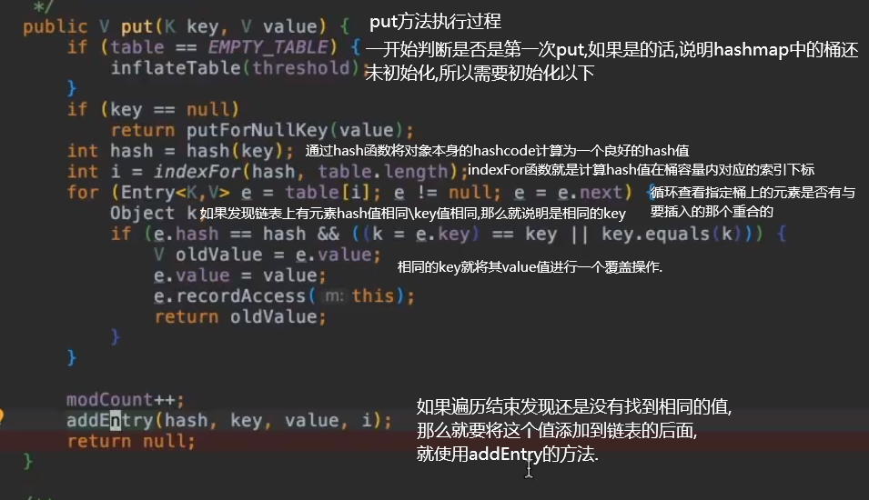
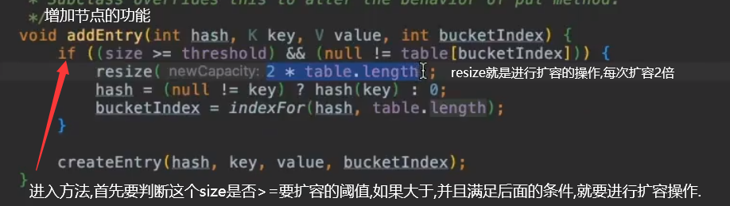
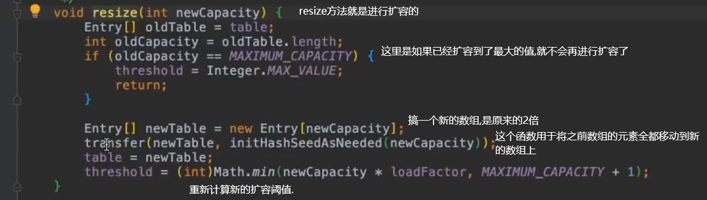
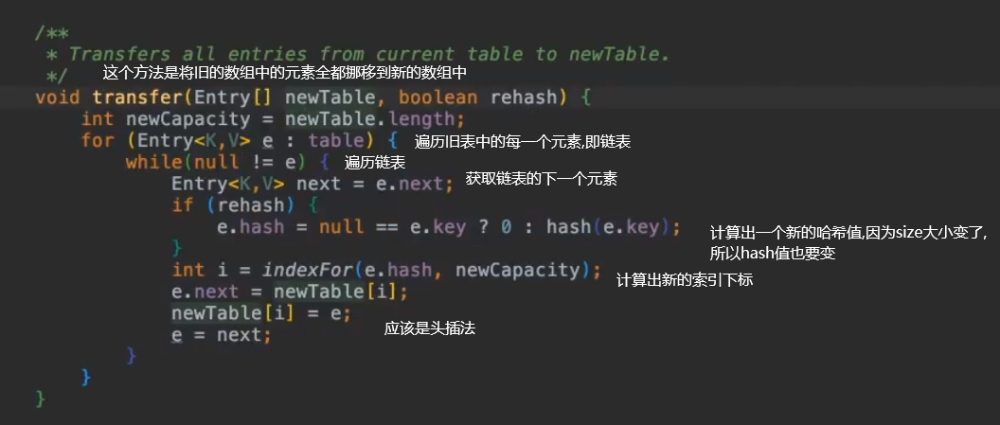
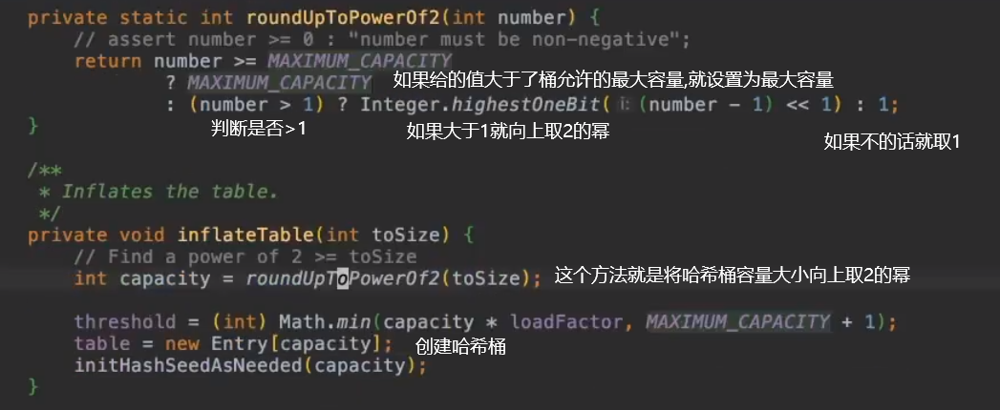

# HashMap

HashMap一共有两个版本，分别是JDK1.7与1.8的版本。在1.8HashMap有了一个大的改进。

* 1.7版本： HashMap使用的是经典的哈希表实现，通过数组和链表的形式实现了哈希表。
* 1.8版本：HashMap进行了改进，使用的是数组、链表外加红黑树。

接下来首先探究1.7版本HashMap的实现。

## 1.7版本HashMap

1.7版本HashMap是基于Map接口对哈希表的实现。

源码：

```java
    // 初始默认容量 16
    static final int DEFAULT_INITIAL_CAPACITY = 1 << 4;

    // 最大容量值
    static final int MAXIMUM_CAPACITY = 1 << 30;

    // 默认负载因子
    static final float DEFAULT_LOAD_FACTOR = 0.75f;

    // 映射表未扩充前的空映射表
    static final Entry<?,?>[] EMPTY_TABLE = {};

    // 映射表数组。其长度必须为 2 次幂
    transient Entry<K,V>[] table = (Entry<K,V>[]) EMPTY_TABLE;

    // 映射表大小
    transient int size;

    // 扩容表的阈值（容量 * 加载因子）。如果table == EMPTY_TABLE，那么阈值等于创建表的初始容量。
    int threshold;

    // 加载因子
    final float loadFactor;

    // 记录数组发生结构修改的次数
    transient int modCount;

    // 阈值的默认值
    static final int ALTERNATIVE_HASHING_THRESHOLD_DEFAULT = Integer.MAX_VALUE;
```

### 函数：

#### hash(Object t)方法

设计目的：获取传参对象的哈希值，然后进行一次补充哈希运算。可以抵御设计很差，分布不均的哈希函数。如果没有这个函数就可能会遇到严重的碰撞


#### put方法

设计目的：将指定的key，value值保存到HashMap中

方法解析：




#### addEntry（）方法

设计目的：增加节点

代码解析：



这个后面的条件`null != table[buckeIndex]`的意思：如果元素要放上去的数组位置上必须已经有元素存在了，也就是说发生了碰撞，这样才可以进行扩容。

所以总结扩容条件就是：map中的节点数大于阈值，并且元素要存放的链表发生了一次碰撞。

#### resize（）方法

设计目的：进行数组扩容。

源码分析：




#### transfer（）方法

用于移动元素。




### 不足之处

1.7版本的hashmap有两个缺点

* 非常容易碰到死锁问题。简单地说，由于transfer方法中移动新旧链表采用的是头插法的方式，那么最终新旧链表会出现一个倒置的关系，这在多线程的情况下是很危险的。假如现在某数组下标下的链表有两个元素，当进行扩容、并且恰巧有两个线程同时对其进行操作的话，将会导致这个链表形成一个环形链表。那么这种情况下就构成了死锁问题，当某事件要对这个链表中的某不存在元素进行访问的话，就会一直循环下去……造成cpu资源100%消耗。不过这个问题纯粹是开发者自己的问题，因为HashMap就不是一个线程安全类。
* 潜在的安全隐患。
  * 这个安全隐患是由于哈希表这个数据结构本身引起的。哈希表有一个致命的缺陷，就是hash碰撞问题。假设我现在通过精心准备，设计了一组数据，它们在经过hash计算后，都拥有相同的hash值，那么最终在HashMap中，就会放在同一个桶中，这就会让hashMap退化为链表的结构，它的时间复杂度是O（n），严重拖累了性能。
  * 安全隐患这点在TomCat中有着严重的体现，在发送http请求的时候，Tomcat使用了HashMap的结构来存储请求的参数，这就造成了一个严重的后果，假如有一个黑客精心设置的一组哈希值相同的字符，就可以完成一个DOS攻击。
  * 这个安全隐患在1.7JDK中有打过一个小小的补丁。


## 1.8版本Hashmap

### 预备知识

#### 红黑树

**定义**

* 每个结点是红的或者是黑的
* 根节点是黑的
* 每个叶节点都是黑的
* 如果一个结点是红的，则他的两个儿子都是黑的
* 对每个结点，从该节点到其叶子节点的所有路径上包含相同数目的黑节点。


**插入**

对于插入的新结点，默认为红色。这是由于第五条条件，如果新结点是黑色的，那么就很难找到一个位置使其插入后不违背第五原则。（不是说找不到，而是比较麻烦，不如红色来的简单）

插入的时候先根据二叉搜索树的性质，将其插入到红黑树中。

然后再查看是否平衡，如果不平衡了，就进行一个平衡的操作，左旋或者右旋，使其平衡。（这里的是否平衡只需要看黑色节点是否平衡即可）

最后再对整个树进行颜色变化，使得满足红黑树定义。这里的颜色变化是服从一定规则的。

**重新叙述：**

先根据二叉搜索树的性质，将其插入到红黑树中。

判断：

如果发现父节点是黑色的，就不用进行调整。

如果父节点是红色的：

​	1、叔叔节点是空的，需要进行旋转+变色。

​	2、叔叔节点不是空的，并且是红色的。只需要变色。将父节点与叔叔节点变为黑色，祖父节点变为红色。

​	3、叔叔节点不是空的，并且是黑色的。旋转加变色

（这种情况不会在直接插入的时候出现，因为不会存在父节点和叔叔结点不同色的红黑树。

这种情况是出现在插入结点，并且进行第一次调整后，这种时候虽然插入结点的子树满足了要求，但是由于父节点、叔叔结点、祖父结点可能颜色变化，导致更大范围的红黑树不满足要求了。

出现了这种情况。这种情况下就要进行旋转+变色的操作。）


### 介绍

1.8版本的Hashmap,实现的是一个基于桶的哈希表,但是当桶变得特别大的时候，会被转化为TreeNode的桶。

由于红黑树的树节点是常规节点的近乎两倍大，所以只有在桶里有足够多的节点才会使用红黑树结构。

这个树化的阈值是8。这是由于在hashcode分布均匀的情况下，它服从泊松分布，一个桶里有8个元素的概率是十万分之一。因此如果发现了超过阈值，就要使用红黑树结构。

### 属性

`TREEIFY_THRESHOLD`这个值的初始值为8，代表着当桶里链表有多少个节点会变成树。


### 问题：

* 为什么1.7的HashMap中的桶容量必须是2的幂次？
  * 这是因为jdk1.7中是通过桶容量-1与hash值按位与进行计算的。桶容量的值如果是2的幂次，那么桶容量-1即`length-1`的值换算为二进制数就会是一个全为1的数字，这样一来，进行按位与操作效率极高，并且也可以让被选中的桶平均分布。
  * 补充：如果桶容量不是2的幂次，那二进制数中就一定会出现为0的位，那么`hash & (lenght -1)`该操作后，就有某些桶永远不会被选中了。比如1101这个数字，就永远不会出现0010、0011、1011、1111……数字，白白浪费了桶的容量。

* 对象的hashcode的值是如何限制在桶范围内的呢？比如16个桶，如何将其限制在0-15的范围内？
  * 最直接的思路就是取模，但是这样是不可取的，有两个缺点：1、hashcode可能会是负数。2、效率比较低。
  * jdk中使用的方法：hash的值与 （length -1）进行 & 操作，即`hash & (lenght -1)`。由于之前规定了length也就是哈希桶的大小永远是2的幂次，这就使得lenght-1换算为二进制数会变成全为1的数字。然后与哈希表进行按位与操作效率很高，并且所有的桶都会被用上。

### 注意点：

* 即使在构造函数中声明HashMap中桶容量不为2的幂次，实际的桶容量依旧会是2的幂次。这是因为在第一次进行put的时候，会初始化哈希表的桶，再次之前，会执行一个`inflateTable(threshold)`方法，在这个方法中，会自动将桶容量的值向上取为2的幂次。

  * 源码分析：

* HashMap在第一次进行put的时候才会初始化哈希表的桶数组，才会实际使用内存空间，这样做是为了节省内存。


